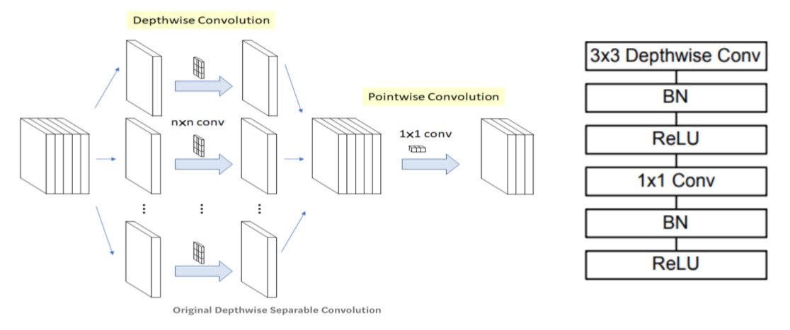
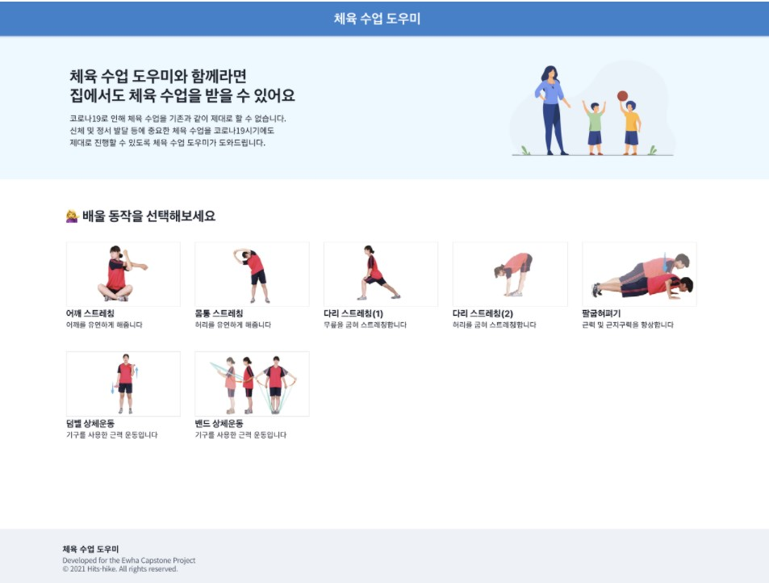
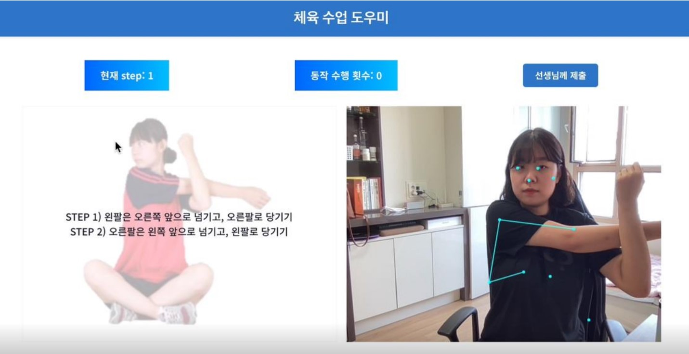

## 체육 수업 온라인, 체온

비대면 체육 수업 지원 서비스

- 비대면(원격)으로도 양질의 체육 수업을 제공할 수
  있도록 지원하는 서비스
- 포즈 인식 기술을 활용해 학생들의 운동 동작 인식
  및 안내를 해주는 서비스
- 학생들이 성실히 임하였는지 동작 확인부터
  출결까지 관리 및 성실도 체크가 가능한 서비스

## Project 배경

- WHO의 청소년 신체 활동량 조사에 의하면 한국
  청소년 중 운동 부족이 94.2%로 146개국 중 1위
- 디지털화로 인한 청소년 활동량 부족 심화,
  운동부족으로 인한 건강상태 악화  
  (출처: 질병관리청 청소년건강행태조사)
- 코로나 19 상황으로 인해 이론 설명 영상 시청
  위주의 체육 수업 진행, 운동 부족 현상 악화
  - 체육 이론 설명 영상 시청만 하는 것은 부적절함
  - 청소년기 학생들의 신체 활동 장려 방안 필요

## 주요 기능


## 주요 기술


- On-device 내 real-time pose estimation이 가능한
  오픈소스인 PoseNet을 활용해 학생이 제대로
  동작을 수행하는 지 판단함
- Webcam에서 프레임 단위로 추출한 RGB 형태의
  입력을 CNN기반 이미지 인식 모델에 넣어 pose
  keypoints 등 여러 출력을 받아 활용함
- 컴퓨팅 자원이 부족한 저사양 환경에서의
  인퍼런스를 위해 경량 모델인 MobileNet을 활용함



- MobileNet의 depthwise separable convolution
  구조를 적용하여 적은 연산량으로도 keypoint
  estimation을 수행하도록 함

## 실행 방법

우선 레포지토리의 코드를 clone 합니다.

```
git clone https://github.com/chorom-ham/pe-assistant.git
```

이후 아래 코드를 통해, 실행시킬 수 있습니다.

```bash
npm install
npm run dev
```

## 프로토타입

---

프토로타입은 개발 중이며, 고도화 과정에 있습니다.

아래 링크에서 프로토타입을 확일할 수 있습니다.

> https://pe-assistant.vercel.app/



